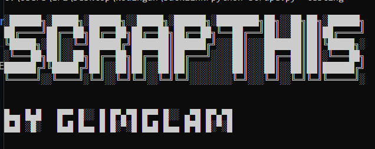

# Backlink Bot
Backlinks are links that point from one website to another website. Backlinks are important for website owners to improve their website's search engine rankings. The more high-quality backlinks a website has, the more likely it is to rank higher in search engine results.
<br><br>
Backlink Bot is a bot project that automates the sending of href comments for backlink purposes on blogspot.com. With Backlink Bot, users can easily send href comments to blogspot.com websites, which can help increase their website's backlinks and improve their search engine rankings.
<br>

|  |
| :---:  |
|    
|     

# Requirement
- Python 3.9
- undetected_chromedriver
- selenium
- python-dotenv

# Feature
- Scrape blogspot.com link
- Automate sending href comments on blogspot.com

# Installation

### Via Git
```bash
git clone https://github.com/EriSetyawan166/backlink.git
```
### Download ZIP
[Link](https://github.com/EriSetyawan166/backlink/archive/refs/heads/master.zip)

Make sure you installed all of the requirements

Navigate to the backlink-bot directory with the command:
```bash
cd backlink-bot
```
Copy .env from .env.example
```bash
copy .env.example .env
```
configure .env with your blogspot account
```bash
EMAIL=example@gmail.com
PASSWORD=pass
```

# How to use
To use the Backlink Bot program, run the program in this order:

1. Run scrape.py to get all of the link, the parameter is up to you to chose an topic you want to scrape
```bash
python scrape.py "your topic to scraped"
```

2. After finished, blogspot_link.txt should be filled with the links.

3. Run backling_bing.py
```bash
python backlink_bing.py
```
4. wait
5. profit, report.txt should be filled with all of the links that succeded

# Modification
By default this bot will send
```bash css
<a href="https://www.budiluhur.ac.id/" rel="dofollow">Thank you for the article!</a>
```

if you want to modify it you can change it in 
```bash 

└── backlink/
    └── util/
        └── send_comments.py
```

```bash py
def send_comments(links, driver):
    code....  
  
    comment = '<a href="https://www.budiluhur.ac.id/" rel="dofollow">Thank you for the article!</a>'

```
# limitation
There are several limitation from this program
1. This program cannot determined if the account already got the limit for sending a comment. In blogspot there are limit for sending a comment, it can be tricked by using vpn. 
2. This program cannot determined if the comment is send in a review state or not. So when it happenned the program will check it as an error/failed.

## Contributors ✨
<table>
  <tr>
    <td align="center"><a href="https://github.com/EriSetyawan166"><br /><sub><b>Muhammad Eri Setyawan</b></sub></a><br/><a href="#" title="Code">💻</a> <a href="#" title="Documentation">📖</td>
  </tr>
</table>

If you would like to contribute, please open a pull request on this repository.
